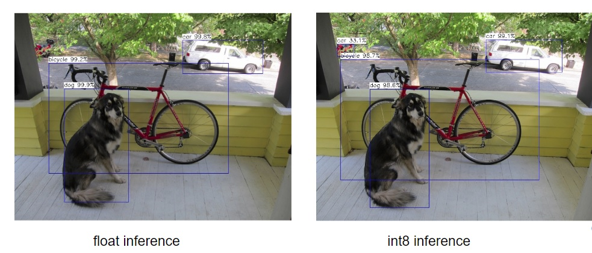

# An experiment project to test quilization performance on mobilenet yolo

## Test accuracy loss of different condition

## merge_bn
Network|mAP|Resolution|Data Type|Framework|Bit
:---:|:---:|:---:|:---:|:---:|:---:
MobileNet-YOLOv3-Lite|0.737|416|float|caffe|32
MobileNet-YOLOv3-Lite|0.725|416|float|ncnn|32
MobileNet-YOLOv3-Lite|0.520|416|int|ncnn|8
MobileNet-YOLOv3-Lite|0.582|416|mixed precision : remove conv0|ncnn|8

## non merge_bn
Network|mAP|Resolution|Data Type|Framework|Bit
:---:|:---:|:---:|:---:|:---:|:---:
Pelee-YOLOv3|0.703|416|float|caffe|32
Pelee-YOLOv3|0.689|416|float|ncnn|32
Pelee-YOLOv3|0.686|416|mixed precision : remove stem1|ncnn|8

Network|mAP|Resolution|Data Type|Framework|Bit
:---:|:---:|:---:|:---:|:---:|:---:
MobileNet-YOLOv3|0.737|416|float|caffe|32
MobileNet-YOLOv3|0.729|416|float|ncnn|32
MobileNet-YOLOv3|0.634|416|int|ncnn|8
MobileNet-YOLOv3|0.668|416|mixed precision : remove conv0|ncnn|8

Model download from previous version [MobileNet-YOLO](https://github.com/eric612/MobileNet-YOLO/tree/329eb1599e5963be62a1bc1c18ffd809270303bc)

## accuracy loss example

## eval mAP project

[Tencent/ncnn](https://github.com/eric612/ncnn)
